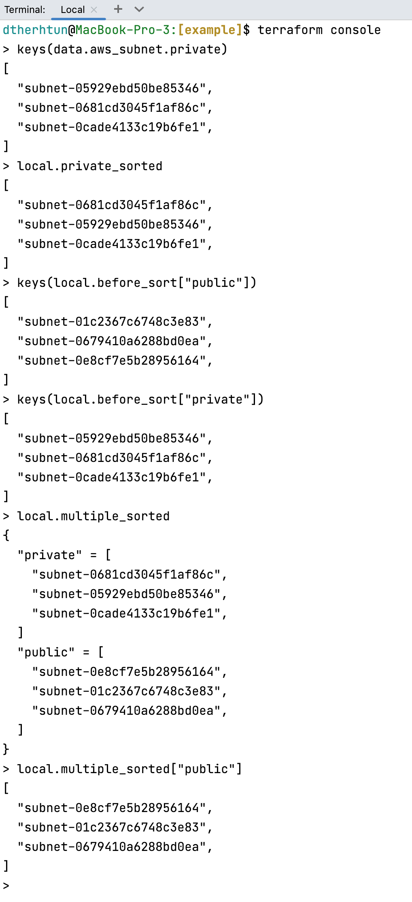

# example

<!-- BEGINNING OF PRE-COMMIT-TERRAFORM DOCS HOOK -->
## Requirements

No requirements.

## Providers

| Name | Version |
|------|---------|
|  [aws](#provider\_aws) | 4.35.0 |

## Modules

| Name | Source | Version |
|------|--------|---------|
|  [multiple\_sort\_az](#module\_multiple\_sort\_az) | ../ | n/a |
|  [sort\_az](#module\_sort\_az) | ../ | n/a |

## Resources

| Name | Type |
|------|------|
| [aws_subnet.private](https://registry.terraform.io/providers/hashicorp/aws/latest/docs/data-sources/subnet) | data source |
| [aws_subnet.public](https://registry.terraform.io/providers/hashicorp/aws/latest/docs/data-sources/subnet) | data source |
| [aws_subnets.private](https://registry.terraform.io/providers/hashicorp/aws/latest/docs/data-sources/subnets) | data source |
| [aws_subnets.public](https://registry.terraform.io/providers/hashicorp/aws/latest/docs/data-sources/subnets) | data source |

## Inputs

No inputs.

## Outputs

No outputs.
<!-- END OF PRE-COMMIT-TERRAFORM DOCS HOOK -->
